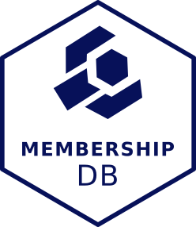

Membership DB is a web-based membership administration application
for [The Carpentries][tc].  Its target audience is Carpentries
staff that need to manage membership information. There is a Membership
feature in [AMY][amy], but it was too rigid and didn't capture the kind
of information needed to track and generate agreements. We're reluctant
to build AMY into a beheamouth of software that does EVERYTHING, so
scope this as a new tool for now, then think about how we can pass info
to/from AMY as needed.

Membership DB is built using [Django][django], with a bit of Javascript
and other things thrown in.  If you would like to help, please read:

*   the setup instructions below,

*   the [contributor guidelines](CONTRIBUTING.md), and

*   our [contributor code of conduct](CONDUCT.md).

Please [check with us][contact-address] or open an [issue][issues]
before starting work on new features.

## Getting Started

1.  Clone the repository:

    ~~~
    $ git clone https://github.com/carpentries/membershipdb.git
    $ cd amy
    ~~~

2.  Install Django and other dependencies:

    ~~~
    $ python3 -m pip install --user -r requirements.txt
    ~~~

    If you're experienced Python programmer, feel free to create a
    Python3-compatible [virtualenv][virtualenv] for Membership DB and install
    dependencies from `requirements.txt`.

1.  Install [Yarn][yarn], the tool that manages Membership DB's JavaScript and CSS
    dependencies, following the directions according your operating system in
    https://yarnpkg.com/lang/en/docs/install/:

2.  Set up your local database with fake (development-ready) data with:

    ~~~
    $ make dev_database
    ~~~
    
3.  Create an administrator account:

    ~~~
    $ python3 manage.py createsuperuser
    ~~~

4.  Start a local Django development server by running:

    ~~~
    $ make serve
    ~~~

    **Note**:  this also installs front-end dependencies for AMY, such as jQuery or Bootstrap.

7.  Open <http://localhost:8000/membership/> in your browser and start clicking.

    Use the administrator account that you created.

## Upgrading

1.  Update the code:

    1.  Get the list of changes:

        ~~~
        $ git fetch
        ~~~

    2.  Look for the newest tag:

        ~~~~
        $ git tag -n
        ~~~~

    3.  Get the code from the newest tag:

        ~~~~
        $ git checkout tags/<tag_name>
        ~~~~

2.  Update dependencies front-end and back-end dependencies:

    ~~~
    $ make upgrade
    ~~~

3.  (Optional) make fresh development-ready database:

    ~~~
    $ make dev_database
    ~~~

4.  Run database migrations:

    ~~~~
    $ python3 manage.py migrate
    ~~~~

5.  Enjoy your new version of Membership DB:

    ~~~
    $ make serve
    ~~~

[amy]: https://github.com/swcarpentry/amy
[contact-address]: mailto:francisco.palm@gmail.com
[django]: https://www.djangoproject.com
[issues]: https://github.com/arpentries/membershipdb/issues
[tc]: http://carpentries.org
[virtualenv]: https://virtualenv.pypa.io/en/latest/userguide.html
[yarn]: https://yarnpkg.com